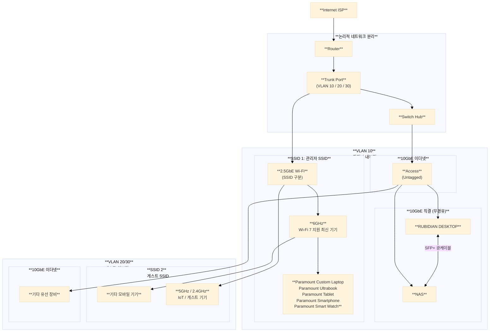

# Paramount Home Lab

---

## Internet

---

|    제품군     |              모델              |                                          비고                                          |
| :--------: | :--------------------------: | :----------------------------------------------------------------------------------: |
|  **라우터**   | ASUS ROG Rapture GT-BE98 Pro |                                          -                                           |
| **스위치 허브** |      QNAP QSW-M2108-2C       | NAS 연결 스위치에 Link Aggregation(LACP) 설정 NAS <=> Workstation은 스위치 허브 경유 없이 직결 브릿지 구성 |

## NAS

---

|      제품군      |                   모델                   |                                        비고                                         |
| :-----------: | :------------------------------------: | :-------------------------------------------------------------------------------: |
| **Main Unit** |           Synology DS1823xs+           |     가상 드라이브 마운트 시 SFTP 사용 DDNS 및 역방향 프록시 활용 외부 DSM 접속 시 QuickConnect 사용     |
|    **RAM**    |         Synology D4ES03-16G x2         |                           기존 8GB RAM 제거 후 부착 (실용량 32GB)                           |
|    **SSD**    |   Synology SNV5410 NVMe x2 800GB x2    |         RAID 1 스토리지 풀 볼륨 1 생성 (실용량 800GB) DSM과 모든 Docker / DB / 패키지 설치         |
|    **HDD**    |        Synology HAT5310 20TB x6        | RAID 6 스토리지 풀 볼륨 2 구성 (실용량 80TB) 대용량 파일 / 미디어 저장 나머지 슬롯은 고장 및 점검 시 예비용으로 사용 |
|    **UPS**    |       APC Smart-UPS SMT1500RM2U        |                                         -                                         |
|  **네트워크 카드**  |           Synology E10G22-SR           |                           듀얼 포트 SFP+ 사용 (최대 대역폭 20Gbps)                           |
|   **광랜 모듈**   |  Intel 10G SFP+ SR Module (E10GSFPSR)  |                                         -                                         |
|   **광패치코드**   | Panduit LC to LC Duplex OM4 Patch Cord |                                         -                                         |

## Architecture

---

